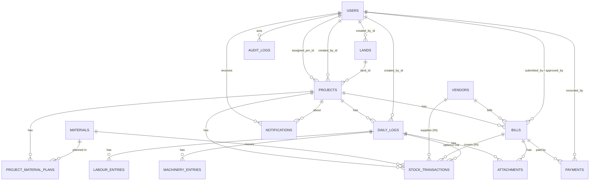

# 04. Database Design

PostgreSQL 16+. **`server/prisma/schema.prisma` is the source of truth** for tables, columns, and relations. Things Prisma cannot express (CHECK constraints, case-insensitive unique indexes, partial indexes, views) live in a hand-written SQL migration (§5).

> Any change to this schema needs: a Prisma migration, an update to this document, and team agreement (see `08-development-workflow.md`).

---

## 1. Overview

- **15 tables** (13 core, 2 stretch: `notifications`, `attachments`).
- Naming: tables `snake_case` plural; columns `snake_case`; Prisma fields `camelCase` via `@map`.
- Primary keys: `INT GENERATED … AS IDENTITY` (Prisma `autoincrement()`).
- Money: `NUMERIC(14,2)` / `(16,2)`. Quantities: `NUMERIC(14,3)`. Percentages: `NUMERIC(5,2)`. Dates without time: `DATE`.
- Soft states instead of deletes for financial/stock data (`is_voided`, bill `status`, `is_active`).

## 2. ER diagram



## 3. Table summary

| Table | Purpose | Key constraints |
|---|---|---|
| `users` | Admins and PMs | `email` unique (stored lowercase) |
| `lands` | Land parcels | index (city, state) |
| `projects` | Construction projects on a land | `code` unique; FK land, PM, creator |
| `materials` | Master list | name unique (case-insensitive) |
| `vendors` | Master list | name unique (case-insensitive); GSTIN unique if present |
| `project_material_plans` | Planned qty per material per project | unique (project, material) |
| `daily_logs` | One per project per day | unique (project, log_date); progress 0-100 |
| `labour_entries` | Labour rows of a log | cascade with log |
| `machinery_entries` | Machinery rows of a log | cascade with log |
| `stock_transactions` | IN/OUT ledger | qty > 0; reason rules; soft void |
| `bills` | Vendor bills | unique (vendor, bill_number); amount checks |
| `payments` | Payments against bills | amount > 0 |
| `audit_logs` | Immutable change history | JSONB old/new |
| `notifications` (S2) | In-app alerts | `dedupe_key` unique |
| `attachments` (S2) | Files on logs/bills | exactly one target (CHECK) |

---

## 4. Prisma schema (source of truth)

> The `generator` block depends on your Prisma version. Use the form from the current Prisma docs. The models and enums below are version-independent.

```prisma
// server/prisma/schema.prisma

generator client {
  provider = "prisma-client-js"
}

datasource db {
  provider = "postgresql"
  url      = env("DATABASE_URL")
}

// ───────────── Enums ─────────────

enum Role {
  ADMIN
  PM
}

enum AreaUnit {
  SQFT
  SQYD
  SQM
  ACRE
}

enum ProjectStatus {
  PLANNING
  ACTIVE
  ON_HOLD
  COMPLETED
}

enum MaterialCategory {
  CEMENT
  STEEL
  SAND_AGGREGATE
  BRICKS_BLOCKS
  TIMBER
  ELECTRICAL
  PLUMBING
  PAINT_FINISH
  OTHER
}

enum StockTxnType {
  IN
  OUT
}

enum OutReason {
  USED
  DAMAGED
  LOST
}

enum BillCategory {
  MATERIAL
  LABOUR
  MACHINERY
  SERVICES
  OTHER
}

enum BillStatus {
  PENDING
  APPROVED
  REJECTED
  PARTIALLY_PAID
  PAID
}

enum PaymentMode {
  CASH
  BANK_TRANSFER
  UPI
  CHEQUE
  OTHER
}

enum AuditAction {
  CREATE
  UPDATE
  DELETE
  APPROVE
  REJECT
  VOID
  LOGIN
}

enum NotificationType {
  LOW_STOCK
  WASTAGE_ALERT
  BILL_OVERDUE
  BILL_SUBMITTED
  BILL_APPROVED
  BILL_REJECTED
  BUDGET_ALERT
}

// ───────────── Models ─────────────

model User {
  id           Int       @id @default(autoincrement())
  name         String
  email        String    @unique
  passwordHash String    @map("password_hash")
  role         Role
  phone        String?
  isActive     Boolean   @default(true) @map("is_active")
  lastLoginAt  DateTime? @map("last_login_at")
  createdAt    DateTime  @default(now()) @map("created_at")
  updatedAt    DateTime  @updatedAt @map("updated_at")

  projectsManaged     Project[]          @relation("ProjectPM")
  projectsCreated     Project[]          @relation("ProjectCreatedBy")
  landsCreated        Land[]
  dailyLogsCreated    DailyLog[]
  stockTxnsCreated    StockTransaction[] @relation("StockTxnCreatedBy")
  stockTxnsVoided     StockTransaction[] @relation("StockTxnVoidedBy")
  billsSubmitted      Bill[]             @relation("BillSubmittedBy")
  billsApproved       Bill[]             @relation("BillApprovedBy")
  paymentsRecorded    Payment[]
  auditLogs           AuditLog[]
  notifications       Notification[]
  attachmentsUploaded Attachment[]

  @@map("users")
}

model Land {
  id           Int       @id @default(autoincrement())
  name         String
  addressLine  String?   @map("address_line")
  city         String
  state        String
  pincode      String?
  areaValue    Decimal   @map("area_value") @db.Decimal(14, 2)
  areaUnit     AreaUnit  @map("area_unit")
  surveyNumber String?   @map("survey_number")
  ownerName    String?   @map("owner_name")
  purchaseDate DateTime? @map("purchase_date") @db.Date
  purchaseCost Decimal?  @map("purchase_cost") @db.Decimal(16, 2)
  notes        String?
  createdById  Int       @map("created_by_id")
  createdAt    DateTime  @default(now()) @map("created_at")
  updatedAt    DateTime  @updatedAt @map("updated_at")

  createdBy User      @relation(fields: [createdById], references: [id])
  projects  Project[]

  @@index([city, state])
  @@map("lands")
}

model Project {
  id                  Int           @id @default(autoincrement())
  landId              Int           @map("land_id")
  code                String        @unique
  name                String
  description         String?
  status              ProjectStatus @default(PLANNING)
  startDate           DateTime?     @map("start_date") @db.Date
  expectedEndDate     DateTime?     @map("expected_end_date") @db.Date
  actualEndDate       DateTime?     @map("actual_end_date") @db.Date
  totalBudget         Decimal       @default(0) @map("total_budget") @db.Decimal(16, 2)
  wastageThresholdPct Decimal       @default(10) @map("wastage_threshold_pct") @db.Decimal(5, 2)
  assignedPmId        Int?          @map("assigned_pm_id")
  createdById         Int           @map("created_by_id")
  createdAt           DateTime      @default(now()) @map("created_at")
  updatedAt           DateTime      @updatedAt @map("updated_at")

  land      Land @relation(fields: [landId], references: [id])
  assignedPm User? @relation("ProjectPM", fields: [assignedPmId], references: [id])
  createdBy User @relation("ProjectCreatedBy", fields: [createdById], references: [id])

  materialPlans     ProjectMaterialPlan[]
  dailyLogs         DailyLog[]
  stockTransactions StockTransaction[]
  bills             Bill[]
  notifications     Notification[]

  @@index([landId])
  @@index([assignedPmId])
  @@index([status])
  @@map("projects")
}

model Material {
  id        Int              @id @default(autoincrement())
  name      String           @unique
  category  MaterialCategory
  unit      String // one of UNITS in lib/constants.ts (validated by Zod)
  isActive  Boolean          @default(true) @map("is_active")
  createdAt DateTime         @default(now()) @map("created_at")
  updatedAt DateTime         @updatedAt @map("updated_at")

  plans             ProjectMaterialPlan[]
  stockTransactions StockTransaction[]

  @@map("materials")
}

model Vendor {
  id            Int      @id @default(autoincrement())
  name          String   @unique
  contactPerson String?  @map("contact_person")
  phone         String?
  email         String?
  gstin         String?  @unique
  address       String?
  isActive      Boolean  @default(true) @map("is_active")
  createdAt     DateTime @default(now()) @map("created_at")
  updatedAt     DateTime @updatedAt @map("updated_at")

  bills             Bill[]
  stockTransactions StockTransaction[]

  @@map("vendors")
}

model ProjectMaterialPlan {
  id                  Int      @id @default(autoincrement())
  projectId           Int      @map("project_id")
  materialId          Int      @map("material_id")
  plannedQuantity     Decimal  @map("planned_quantity") @db.Decimal(14, 3)
  plannedUnitRate     Decimal? @map("planned_unit_rate") @db.Decimal(12, 2)
  lowStockThreshold   Decimal? @map("low_stock_threshold") @db.Decimal(14, 3)
  wastageThresholdPct Decimal? @map("wastage_threshold_pct") @db.Decimal(5, 2) // overrides project default
  createdAt           DateTime @default(now()) @map("created_at")
  updatedAt           DateTime @updatedAt @map("updated_at")

  project  Project  @relation(fields: [projectId], references: [id])
  material Material @relation(fields: [materialId], references: [id])

  @@unique([projectId, materialId])
  @@map("project_material_plans")
}

model DailyLog {
  id              Int      @id @default(autoincrement())
  projectId       Int      @map("project_id")
  logDate         DateTime @map("log_date") @db.Date
  progressPercent Decimal  @map("progress_percent") @db.Decimal(5, 2) // cumulative 0-100
  workSummary     String   @map("work_summary")
  weather         String?
  issues          String?
  createdById     Int      @map("created_by_id")
  createdAt       DateTime @default(now()) @map("created_at")
  updatedAt       DateTime @updatedAt @map("updated_at")

  project          Project            @relation(fields: [projectId], references: [id])
  createdBy        User               @relation(fields: [createdById], references: [id])
  labourEntries    LabourEntry[]
  machineryEntries MachineryEntry[]
  stockTransactions StockTransaction[]
  attachments      Attachment[]

  @@unique([projectId, logDate])
  @@index([projectId, logDate(sort: Desc)])
  @@map("daily_logs")
}

model LabourEntry {
  id             Int     @id @default(autoincrement())
  dailyLogId     Int     @map("daily_log_id")
  trade          String
  contractorName String? @map("contractor_name")
  headCount      Int     @map("head_count")
  hoursWorked    Decimal @default(8) @map("hours_worked") @db.Decimal(4, 1)
  remarks        String?

  dailyLog DailyLog @relation(fields: [dailyLogId], references: [id], onDelete: Cascade)

  @@index([dailyLogId])
  @@map("labour_entries")
}

model MachineryEntry {
  id           Int      @id @default(autoincrement())
  dailyLogId   Int      @map("daily_log_id")
  machineName  String   @map("machine_name")
  operatorName String?  @map("operator_name")
  hoursUsed    Decimal  @map("hours_used") @db.Decimal(5, 2)
  fuelLitres   Decimal? @map("fuel_litres") @db.Decimal(8, 2)
  remarks      String?

  dailyLog DailyLog @relation(fields: [dailyLogId], references: [id], onDelete: Cascade)

  @@index([dailyLogId])
  @@map("machinery_entries")
}

model StockTransaction {
  id              Int          @id @default(autoincrement())
  projectId       Int          @map("project_id")
  materialId      Int          @map("material_id")
  txnType         StockTxnType @map("txn_type")
  quantity        Decimal      @db.Decimal(14, 3)
  unitRate        Decimal?     @map("unit_rate") @db.Decimal(12, 2) // informational, IN only
  vendorId        Int?         @map("vendor_id")                    // IN only
  billId          Int?         @map("bill_id")                      // IN only
  challanNumber   String?      @map("challan_number")
  outReason       OutReason?   @map("out_reason")                   // OUT only
  txnDate         DateTime     @map("txn_date") @db.Date
  dailyLogId      Int?         @map("daily_log_id")
  remarks         String?
  createdById     Int          @map("created_by_id")
  createdAt       DateTime     @default(now()) @map("created_at")
  isVoided        Boolean      @default(false) @map("is_voided")
  voidedById      Int?         @map("voided_by_id")
  voidedAt        DateTime?    @map("voided_at")
  voidReason      String?      @map("void_reason")

  project   Project   @relation(fields: [projectId], references: [id])
  material  Material  @relation(fields: [materialId], references: [id])
  vendor    Vendor?   @relation(fields: [vendorId], references: [id])
  bill      Bill?     @relation(fields: [billId], references: [id])
  dailyLog  DailyLog? @relation(fields: [dailyLogId], references: [id], onDelete: SetNull)
  createdBy User      @relation("StockTxnCreatedBy", fields: [createdById], references: [id])
  voidedBy  User?     @relation("StockTxnVoidedBy", fields: [voidedById], references: [id])

  @@index([projectId, materialId, txnDate])
  @@index([vendorId])
  @@index([billId])
  @@map("stock_transactions")
}

model Bill {
  id              Int          @id @default(autoincrement())
  projectId       Int          @map("project_id")
  vendorId        Int          @map("vendor_id")
  billNumber      String       @map("bill_number")
  billDate        DateTime     @map("bill_date") @db.Date
  dueDate         DateTime?    @map("due_date") @db.Date
  category        BillCategory
  description     String?
  baseAmount      Decimal      @map("base_amount") @db.Decimal(14, 2)
  gstPercent      Decimal      @default(0) @map("gst_percent") @db.Decimal(5, 2)
  gstAmount       Decimal      @map("gst_amount") @db.Decimal(14, 2)
  totalAmount     Decimal      @map("total_amount") @db.Decimal(14, 2)
  status          BillStatus   @default(PENDING)
  submittedById   Int          @map("submitted_by_id")
  approvedById    Int?         @map("approved_by_id")
  approvedAt      DateTime?    @map("approved_at")
  rejectionReason String?      @map("rejection_reason")
  createdAt       DateTime     @default(now()) @map("created_at")
  updatedAt       DateTime     @updatedAt @map("updated_at")

  project     Project            @relation(fields: [projectId], references: [id])
  vendor      Vendor             @relation(fields: [vendorId], references: [id])
  submittedBy User               @relation("BillSubmittedBy", fields: [submittedById], references: [id])
  approvedBy  User?              @relation("BillApprovedBy", fields: [approvedById], references: [id])
  payments    Payment[]
  deliveries  StockTransaction[]
  attachments Attachment[]

  @@unique([vendorId, billNumber])
  @@index([projectId, status])
  @@index([status, dueDate])
  @@map("bills")
}

model Payment {
  id              Int         @id @default(autoincrement())
  billId          Int         @map("bill_id")
  amount          Decimal     @db.Decimal(14, 2)
  paymentDate     DateTime    @map("payment_date") @db.Date
  mode            PaymentMode
  referenceNumber String?     @map("reference_number")
  remarks         String?
  recordedById    Int         @map("recorded_by_id")
  createdAt       DateTime    @default(now()) @map("created_at")

  bill       Bill @relation(fields: [billId], references: [id])
  recordedBy User @relation(fields: [recordedById], references: [id])

  @@index([billId])
  @@map("payments")
}

model AuditLog {
  id         Int         @id @default(autoincrement())
  userId     Int?        @map("user_id")
  action     AuditAction
  entityType String      @map("entity_type")
  entityId   Int?        @map("entity_id")
  oldValues  Json?       @map("old_values")
  newValues  Json?       @map("new_values")
  ipAddress  String?     @map("ip_address")
  createdAt  DateTime    @default(now()) @map("created_at")

  user User? @relation(fields: [userId], references: [id])

  @@index([entityType, entityId])
  @@index([userId, createdAt])
  @@index([createdAt])
  @@map("audit_logs")
}

// ───────────── Stretch (S2) ─────────────

model Notification {
  id        Int              @id @default(autoincrement())
  userId    Int              @map("user_id")
  type      NotificationType
  title     String
  message   String
  projectId Int?             @map("project_id")
  link      String?
  isRead    Boolean          @default(false) @map("is_read")
  dedupeKey String?          @unique @map("dedupe_key") // e.g. "BILL_OVERDUE:bill:12:2026-10-04"
  createdAt DateTime         @default(now()) @map("created_at")

  user    User     @relation(fields: [userId], references: [id])
  project Project? @relation(fields: [projectId], references: [id])

  @@index([userId, isRead, createdAt])
  @@map("notifications")
}

model Attachment {
  id           Int      @id @default(autoincrement())
  dailyLogId   Int?     @map("daily_log_id")
  billId       Int?     @map("bill_id")
  fileName     String   @map("file_name")
  storedPath   String   @map("stored_path")
  mimeType     String   @map("mime_type")
  sizeBytes    Int      @map("size_bytes")
  uploadedById Int      @map("uploaded_by_id")
  createdAt    DateTime @default(now()) @map("created_at")

  dailyLog   DailyLog? @relation(fields: [dailyLogId], references: [id], onDelete: Cascade)
  bill       Bill?     @relation(fields: [billId], references: [id], onDelete: Cascade)
  uploadedBy User      @relation(fields: [uploadedById], references: [id])

  @@index([dailyLogId])
  @@index([billId])
  @@map("attachments")
}
```

---

## 5. SQL supplement (hand-written migration)

Create an empty migration and paste this in:

```bash
cd server
npx prisma migrate dev --create-only --name db_constraints_and_views
# edit the generated migration.sql, paste the SQL below, then:
npx prisma migrate dev
```

```sql
-- ============ CHECK constraints ============
ALTER TABLE projects
  ADD CONSTRAINT chk_projects_budget CHECK (total_budget >= 0),
  ADD CONSTRAINT chk_projects_threshold CHECK (wastage_threshold_pct BETWEEN 0 AND 100);

ALTER TABLE project_material_plans
  ADD CONSTRAINT chk_plan_qty CHECK (planned_quantity > 0);

ALTER TABLE daily_logs
  ADD CONSTRAINT chk_log_progress CHECK (progress_percent BETWEEN 0 AND 100);

ALTER TABLE labour_entries
  ADD CONSTRAINT chk_labour_headcount CHECK (head_count > 0),
  ADD CONSTRAINT chk_labour_hours CHECK (hours_worked >= 0 AND hours_worked <= 24);

ALTER TABLE machinery_entries
  ADD CONSTRAINT chk_machinery_hours CHECK (hours_used >= 0 AND hours_used <= 24);

ALTER TABLE stock_transactions
  ADD CONSTRAINT chk_stock_qty_positive CHECK (quantity > 0),
  ADD CONSTRAINT chk_stock_reason CHECK (
    (txn_type = 'IN'  AND out_reason IS NULL) OR
    (txn_type = 'OUT' AND out_reason IS NOT NULL)),
  ADD CONSTRAINT chk_stock_in_only_links CHECK (
    txn_type = 'IN' OR (vendor_id IS NULL AND bill_id IS NULL AND unit_rate IS NULL)),
  ADD CONSTRAINT chk_stock_void_fields CHECK (
    is_voided = TRUE OR (voided_by_id IS NULL AND voided_at IS NULL AND void_reason IS NULL));

ALTER TABLE bills
  ADD CONSTRAINT chk_bill_amounts CHECK (
    base_amount >= 0 AND gst_percent BETWEEN 0 AND 100
    AND gst_amount >= 0 AND total_amount = base_amount + gst_amount),
  ADD CONSTRAINT chk_bill_due CHECK (due_date IS NULL OR due_date >= bill_date),
  ADD CONSTRAINT chk_bill_approval CHECK (
    status NOT IN ('APPROVED','PARTIALLY_PAID','PAID') OR (approved_by_id IS NOT NULL AND approved_at IS NOT NULL));

ALTER TABLE payments
  ADD CONSTRAINT chk_payment_amount CHECK (amount > 0);

ALTER TABLE attachments
  ADD CONSTRAINT chk_attachment_target CHECK (
    (daily_log_id IS NOT NULL)::int + (bill_id IS NOT NULL)::int = 1);

-- ============ Case-insensitive uniqueness ============
CREATE UNIQUE INDEX uq_materials_name_ci ON materials (lower(name));
CREATE UNIQUE INDEX uq_vendors_name_ci   ON vendors   (lower(name));

-- ============ Partial index for overdue / open-bill queries ============
CREATE INDEX idx_bills_open_due ON bills (due_date)
  WHERE status IN ('APPROVED', 'PARTIALLY_PAID');

-- ============ Views ============
CREATE OR REPLACE VIEW v_stock_balance AS
SELECT
  t.project_id,
  t.material_id,
  COALESCE(SUM(t.quantity) FILTER (WHERE t.txn_type = 'IN'),  0) AS total_in,
  COALESCE(SUM(t.quantity) FILTER (WHERE t.txn_type = 'OUT'), 0) AS total_out,
  COALESCE(SUM(CASE WHEN t.txn_type = 'IN' THEN t.quantity ELSE -t.quantity END), 0) AS balance
FROM stock_transactions t
WHERE t.is_voided = FALSE
GROUP BY t.project_id, t.material_id;

CREATE OR REPLACE VIEW v_wastage_status AS
WITH latest_progress AS (
  SELECT DISTINCT ON (project_id) project_id, progress_percent
  FROM daily_logs
  ORDER BY project_id, log_date DESC
),
usage AS (
  SELECT project_id, material_id,
    COALESCE(SUM(quantity) FILTER (WHERE txn_type = 'OUT'), 0) AS consumed_qty,
    COALESCE(SUM(quantity) FILTER (WHERE txn_type = 'OUT' AND out_reason IN ('DAMAGED','LOST')), 0) AS recorded_wastage_qty
  FROM stock_transactions
  WHERE is_voided = FALSE
  GROUP BY project_id, material_id
)
SELECT
  pl.project_id,
  pl.material_id,
  pl.planned_quantity,
  pl.planned_unit_rate,
  COALESCE(lp.progress_percent, 0)                                            AS progress_percent,
  ROUND(pl.planned_quantity * COALESCE(lp.progress_percent, 0) / 100, 3)      AS expected_qty,
  COALESCE(u.consumed_qty, 0)                                                 AS consumed_qty,
  COALESCE(u.recorded_wastage_qty, 0)                                         AS recorded_wastage_qty,
  GREATEST(COALESCE(u.consumed_qty, 0)
           - ROUND(pl.planned_quantity * COALESCE(lp.progress_percent, 0) / 100, 3), 0) AS overrun_qty,
  COALESCE(pl.wastage_threshold_pct, p.wastage_threshold_pct)                 AS threshold_pct
FROM project_material_plans pl
JOIN projects p ON p.id = pl.project_id
LEFT JOIN latest_progress lp ON lp.project_id = pl.project_id
LEFT JOIN usage u ON u.project_id = pl.project_id AND u.material_id = pl.material_id;
```

> Prisma does not manage views. Query them with `prisma.$queryRaw`. The TS service then derives `overrunPct`, `estimatedLoss`, and `status` (`OK` / `OVERRUN` / `NO_BASELINE`) per `07-business-rules.md` §2.
>
> Enum type names in Postgres follow the Prisma enum names (e.g. `"StockTxnType"`); comparing with string literals as above works. If you add `@@map` to enums, nothing in this SQL changes.

---

## 6. Index rationale

| Index | Serves |
|---|---|
| `projects(assigned_pm_id)` | PM's project list (the most common scoped query) |
| `projects(status)`, `projects(land_id)` | Dashboard counts, filters |
| `daily_logs(project_id, log_date DESC)` | Log list, latest progress lookup |
| `stock_transactions(project_id, material_id, txn_date)` | Ledger, balances, wastage |
| `bills(project_id, status)` | Project bill lists, approval queues |
| `bills(status, due_date)` + partial open-bill index | Overdue detection |
| `payments(bill_id)` | Paid-total per bill |
| `audit_logs(entity_type, entity_id)` | "History of this record" |
| `notifications(user_id, is_read, created_at)` | Bell badge and unread list |

---

## 7. Reference queries (use via `$queryRaw`)

**Spend per project.** Aggregate bills and payments **separately** to avoid join fan-out (joining payments to bills would multiply bill totals).

```sql
WITH bill_totals AS (
  SELECT project_id,
    COALESCE(SUM(total_amount) FILTER (WHERE status IN ('APPROVED','PARTIALLY_PAID','PAID')), 0) AS committed,
    COALESCE(SUM(total_amount) FILTER (WHERE status = 'PENDING'), 0)                              AS pending_exposure
  FROM bills
  GROUP BY project_id
),
paid AS (
  SELECT b.project_id, SUM(pay.amount) AS paid
  FROM payments pay JOIN bills b ON b.id = pay.bill_id
  GROUP BY b.project_id
)
SELECT p.id, p.name, p.total_budget,
       COALESCE(bt.committed, 0)        AS committed,
       COALESCE(bt.pending_exposure, 0) AS pending_exposure,
       COALESCE(pd.paid, 0)             AS paid,
       p.total_budget - COALESCE(bt.committed, 0) AS remaining_budget
FROM projects p
LEFT JOIN bill_totals bt ON bt.project_id = p.id
LEFT JOIN paid pd        ON pd.project_id = p.id
WHERE ($1::int IS NULL OR p.assigned_pm_id = $1);   -- PM scoping
```

**Bills with outstanding amount and overdue flag**
```sql
SELECT b.*,
       b.total_amount - COALESCE(SUM(pay.amount), 0) AS outstanding,
       (b.due_date < CURRENT_DATE AND b.status IN ('APPROVED','PARTIALLY_PAID')) AS is_overdue
FROM bills b
LEFT JOIN payments pay ON pay.bill_id = b.id
GROUP BY b.id;
```

**Low-stock materials**
```sql
SELECT pl.project_id, pl.material_id, COALESCE(sb.balance, 0) AS balance, pl.low_stock_threshold
FROM project_material_plans pl
LEFT JOIN v_stock_balance sb ON sb.project_id = pl.project_id AND sb.material_id = pl.material_id
WHERE pl.low_stock_threshold IS NOT NULL
  AND COALESCE(sb.balance, 0) <= pl.low_stock_threshold;
```

---

## 8. Seed data specification (`prisma/seed.ts`)

Seed must be **idempotent-friendly** (safe to run after `db:reset`) and realistic enough to demo every screen.

| Entity | Seed content |
|---|---|
| Users | 1 Admin (`admin@buildtrack.test` / `Admin@123`); 2 PMs (`pm1@…`, `pm2@…` / `Pm@12345`); 1 inactive PM |
| Lands | 3: Sonipat (Haryana), Pune (Maharashtra), Jaipur (Rajasthan) |
| Projects | 4: statuses covering `ACTIVE` ×2, `PLANNING` ×1, `COMPLETED` ×1; budgets from ₹2 Cr to ₹12 Cr; PM1 gets 2, PM2 gets 1 |
| Materials | ~12: cement (bag), TMT steel (kg or tonne), sand (cft), aggregate (cft), bricks (nos), paint (litre), etc. |
| Vendors | ~6 with realistic GSTINs (valid format) |
| Plans | Per active project: 5-6 materials with planned qty, rate, low-stock threshold |
| Daily logs | ~20 per active project over the last 30 days, progress rising from ~10% to ~45%, with labour and machinery rows |
| Stock | IN and OUT matching the logs; **deliberately make at least one material overrun** (e.g. cement consumed ≈ 25% above expected) and one low stock |
| Bills | ~25 across all statuses: PENDING ×5, REJECTED ×2, APPROVED ×6 (2 overdue), PARTIALLY_PAID ×4, PAID ×8 |
| Payments | Consistent with bill statuses (partial payments sum below total; paid equals total) |

Seed must respect all business rules (no negative stock, totals = base + GST, payments ≤ total).

---

## 9. Migration rules

1. Never edit an applied migration. Create a new one.
2. One schema change per PR, with the migration file committed.
3. After pulling changes that include migrations, run `npm run db:migrate`.
4. Destructive changes (drop column/table) need team agreement first.
5. Keep the SQL supplement in its own migration so it is easy to find; later constraint changes get new migrations.
6. `db:reset` is for local only. It destroys data.
